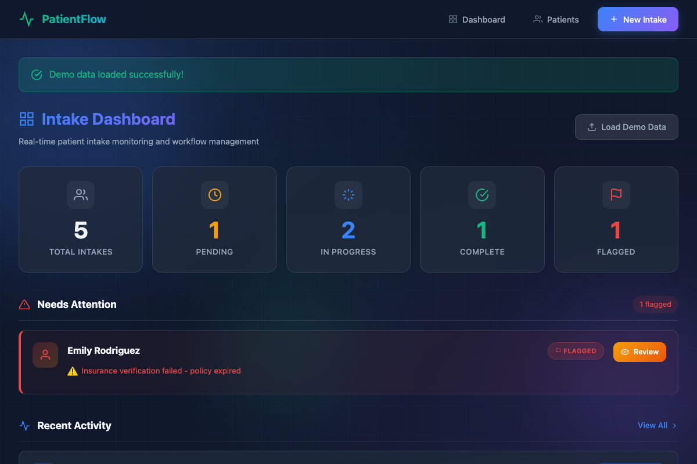

# PatientFlow: Healthcare Intake Automation



## The Problem

I spent time observing healthcare operations, and patient intake is consistently painful:

- **For patients**: Fill out the same information on 4 different clipboards. Write your allergies three times. Wait while someone manually verifies your insurance by phone.

- **For staff**: Manually track which patients have completed which steps. Chase down missing signatures. No visibility into why the waiting room is backed up.

- **For administrators**: No data on bottlenecks. Can't tell if delays are from insurance verification, consent forms, or ID checks. Reactive instead of proactive.

The core issue isn't technology—it's workflow visibility. Staff don't know what's pending, what's blocked, and what needs attention *right now*.

## What I Built

A workflow automation system for patient intake that provides:

1. **Structured 5-step process** with clear ownership and status
2. **Real-time dashboard** showing bottlenecks at a glance
3. **Flagging system** to surface problems immediately
4. **Progress tracking** per patient with completion percentages

This isn't an EHR replacement. It's the operational layer that sits alongside clinical systems to manage the intake workflow specifically.

## The Workflow

```
┌─────────────────────────────────────────────────────────────────┐
│  PATIENT INTAKE WORKFLOW                                         │
│                                                                  │
│  ┌──────────────┐    Status: PENDING (0%)                       │
│  │ 1. Personal  │    Patient created, no steps complete         │
│  │    Info      │                                                │
│  └──────┬───────┘                                                │
│         │                                                        │
│         ▼         Status: IN PROGRESS (20-80%)                   │
│  ┌──────────────┐ At least one step complete                    │
│  │ 2. Insurance │                                                │
│  │    Verify    │ ← Most common bottleneck                       │
│  └──────┬───────┘   (can FLAG here if verification fails)       │
│         │                                                        │
│         ▼                                                        │
│  ┌──────────────┐                                                │
│  │ 3. Medical   │                                                │
│  │    History   │                                                │
│  └──────┬───────┘                                                │
│         │                                                        │
│         ▼                                                        │
│  ┌──────────────┐                                                │
│  │ 4. Consent   │                                                │
│  │    Forms     │                                                │
│  └──────┬───────┘                                                │
│         │                                                        │
│         ▼                                                        │
│  ┌──────────────┐    Status: COMPLETE (100%)                    │
│  │ 5. ID        │    All steps done, timestamp recorded         │
│  │    Verify    │                                                │
│  └──────────────┘                                                │
│                                                                  │
│  At any step: FLAG → Status: FLAGGED (requires attention)       │
└─────────────────────────────────────────────────────────────────┘
```

## Key Decisions & Tradeoffs

### Why a 5-step fixed workflow?

I considered a configurable workflow engine where admins define their own steps. But that adds significant complexity:
- Step dependency management
- Conditional branching logic
- Admin UI for workflow design
- Migration handling when workflows change

**Tradeoff**: Fixed workflow is less flexible but ships faster and is easier to reason about. For a real deployment, I'd validate these 5 steps with actual healthcare ops before adding configurability.

### Why a flagging system instead of just status?

Early versions had only: pending → in progress → complete. But reality is messier. Insurance verification fails. ID doesn't match. Patient leaves mid-intake.

Flags let staff mark *why* something is stuck without losing the workflow state. A flagged intake at step 2 is different from one stuck at step 4—the flag adds context.

### Why server-rendered templates instead of a SPA?

For internal tools used by staff on shared workstations:
- No build step = simpler deployment
- Works without JavaScript (progressive enhancement)
- Faster initial load
- Easier to maintain

A React SPA would be overkill for a workflow dashboard. Server-rendered HTML with minimal JS is the right tool here.

### Why SQLite?

It's a portfolio project. SQLite means:
- No database server to configure
- Single file to back up
- Easy to swap for PostgreSQL via SQLAlchemy

The `DATABASE_URL` environment variable lets you point at any SQL database. The ORM abstracts the difference.

## Data Model

```
Patient
├── id, first_name, last_name, dob
├── email, phone, address
├── emergency_contact_name, emergency_contact_phone
└── intake_record (1:1)

IntakeRecord
├── status: pending | in_progress | complete | flagged
├── Step completion flags (5 booleans)
├── Insurance data (provider, policy, group)
├── Medical history (allergies, meds, conditions)
├── Timestamps (started, completed, updated)
├── flagged_reason (if flagged)
└── Computed: completion_percentage, pending_steps
```

## Tech Stack

| Component | Choice | Why |
|-----------|--------|-----|
| Backend | Flask | Lightweight, good for internal tools |
| ORM | SQLAlchemy | Database abstraction, migrations |
| Database | SQLite | Zero config, swappable |
| Templates | Jinja2 | Server-rendered, fast |
| Styling | Vanilla CSS | No build step |

## What I'd Do Differently

**1. Add audit logging.** Healthcare requires knowing who did what when. Every status change should log the user, timestamp, and previous value. I'd add an `audit_log` table with foreign keys to patients and users.

**2. Implement user authentication.** Currently no login—anyone can access everything. Real deployment needs role-based access: front desk vs. clinical vs. admin.

**3. Add notifications.** When intake is flagged, the relevant person should get alerted (email, Slack, SMS). Currently you have to watch the dashboard.

**4. Build a patient-facing intake form.** Right now staff enter everything. A patient portal where they pre-fill info before arrival would reduce data entry and wait times.

**5. Add analytics.** Average time per step. Most common flag reasons. Peak bottleneck hours. This data would help optimize staffing and process.

## Running It

```bash
git clone https://github.com/[username]/patient-intake-automation
cd patient-intake-automation
pip install -r requirements.txt

python run.py
# → http://localhost:5100

# Load demo data: click "Load Demo Data" on dashboard
```

## Dashboard Views

| View | Purpose |
|------|---------|
| Dashboard | Stats overview, flagged items, recent activity |
| New Intake | Create patient and start workflow |
| Patient Detail | Step-by-step workflow with inline forms |
| Patient List | All patients, filterable by status |

## What This Demonstrates

- **Domain knowledge**: Understanding healthcare operations pain points
- **Workflow design**: State machines, status transitions, exception handling
- **Practical architecture**: Right-sized tech for the problem
- **Product thinking**: What to build vs. what to defer

---

*This project reflects how I approach operational problems: observe the workflow, identify the bottlenecks, build the simplest thing that provides visibility. The code is straightforward because the value is in the workflow design, not the technology.*
